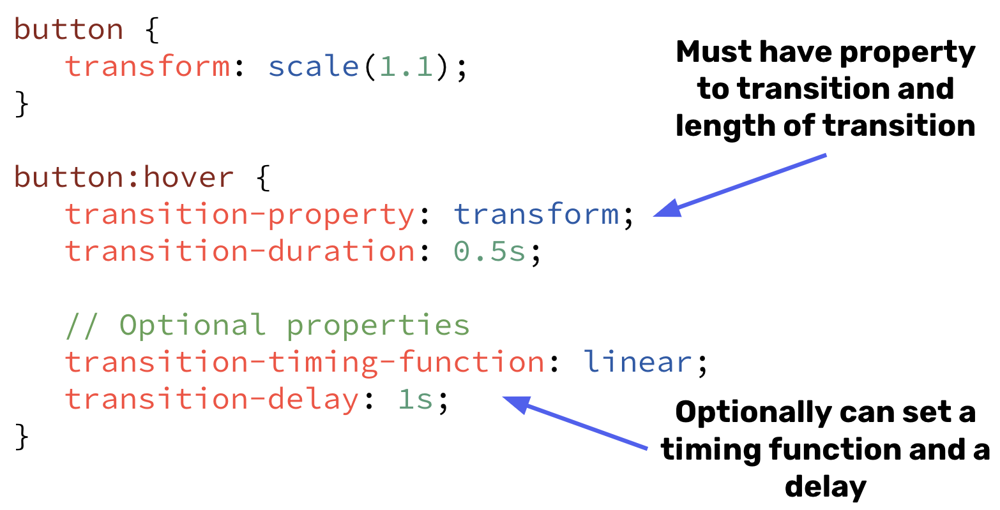

# Transitions
Most of the time, when we talk about animations in CSS we're really talking about transitions. While the terms can be synonymous (a transition is an animation) their uses differ greatly! With just a few lines of code we can add transitions to just about anything.

Recall, a transition requires going between two distinct states. [In the example from the last section](https://codepen.io/stevenjlance/pen/eYPyLYo), we saw that when we hovered our mouse over the button below it transitioned from a width of 100px to a width of 300px (these are our 2 states!).

⭐ <span style = "color: #21B581">**There are 4 main properties when using transitions, and only 2 are required to actually add a transition.**</span>

### What We Will Learn
- `transition-property`
- `transition-duration`
- `transition-timing-function`
- `transition-delay`

>[CSS Transition Video](https://www.loom.com/share/8b9087d1586a4c0aa960eca9997cbefa)

## Try It Out 💻

1. A button has been added with minimal styling. Press "Run". You should see the button, but it doesn't do anything (yet). Let's animate it using `transform`! We want to make the button scale by 10% (`scale(1.1);`) when we hover over it. Work inside of style.css. 
    - **NOTE**: When you make a change to the code, hit the refresh 🔁 icon just above the IDE's browser window (the white box that actually renders out our button) to see the changes.
2. Inside of the `.btn {}` selector let's specify that the property we want to transition is transform
    <details>

    ```css
    .btn {
        /* ...other styles */
        transition-property: transform;
    }
    ```

    </details>
3. Add a `transition-duration` of `0.5s`.
4. On the `.btn`'s `hover` state, let's actually transform the scale! Now the button should be transforming when we hover over it! 🚀
    <details>

    ```css
    .btn:hover {
        transform: scale(1.1);
    }
    ```
    </details>

5. Try adding a `transition-timing-function` ([docs](https://developer.mozilla.org/en-US/docs/Web/CSS/transition-timing-function)). A few values that can be passed are `linear`, `ease`, `ease-in`, `ease-out`. Try switching between them! A more powerful function is the `cubic-bezier()` ([docs](https://developer.mozilla.org/en-US/docs/Web/CSS/easing-function#using_the_cubic-bezier_function)), while it may be a little intimidating at first, it can provide a lot of power to customize the movement of a transition.
    <details>

    ```css
    .btn {
        /* try swapping these out and see how it changes the movement */
        transition-timing-function: cubic-bezier(0.5, 0, 0.5, 1);
        transition-timing-function: cubic-bezier(0.55, 0.085, 0.68, 2);
        transition-timing-function: cubic-bezier(0.77, 0, 0.175, 1);
    }
    ```

    </details>
6. Lastly, add a delay so that when you hover over the button it takes a second or 2 for the transition to start.
    <details>

    ```css
    .btn {
        transition-delay: 1s;
    }
    ```

    </details>

## CSS Transitions Syntax 🖊



## #checkoutTheDocs 🔍
- **MDN**: [CSS Transitions Guide](https://developer.mozilla.org/en-US/docs/Web/CSS/CSS_Transitions)
- [Cubic-Bezier Generator and Viewer](https://cubic-bezier.com/#.5,0,.5,1.2)
- **MDN Reference**
    - [Transition (shorthand)](https://developer.mozilla.org/en-US/docs/Web/CSS/transition)
    - [Transition-Property](https://developer.mozilla.org/en-US/docs/Web/CSS/transition-property)
    - [Transition-Duration](https://developer.mozilla.org/en-US/docs/Web/CSS/transition-duration)
    - [Transition-Timing-Function](https://developer.mozilla.org/en-US/docs/Web/CSS/transition-timing-function)
    - [Transition-Delay](https://developer.mozilla.org/en-US/docs/Web/CSS/transition-delay)

## Knowledge Check ✅

1. When should we apply a `transition` instead of an `animation`?
    - Complex animations including multiple stages
    - **Simple animations including just a starting and stopping point**
    - **In most scenarios to add simple animations**

2. Which line dictates how the "in-between" frames behave in a transition (after point A and before point B)?
    ```CSS
    .btn {
        transition-property: translateX;
        transition-duration: 0.3s;
        transition-timing-function: ease-out;
        transition-delay: 0s;
    }
    ```
    - `transition-property: translateX;`
    - `transition-duration: 0.3s;`
    - **`transition-timing-function: ease-out;`**
    - `transition-delay: 0s;`


