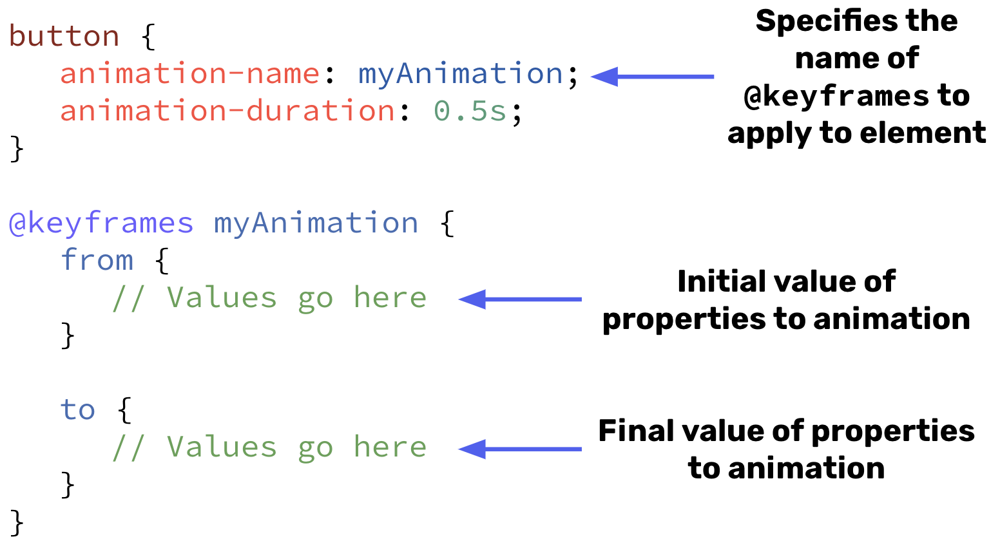

# Animations

The animation properties are the real powerhouse behind animations on web pages. Utilizing `keyframes` and `animation`s we can choreograph incredibly complex works of art.

Recall, that in the introduction section [we introduced the following animation](https://codepen.io/stevenjlance/pen/LYgeJVG).

This animation had 4 `keyframes` each with their own distinct color. By defining these 4 distinct phases (and utilizing the `animation-iteration-count` property) we were able to create a continuous animation on the page.

⭐ <span style = "color: #21B581">**Animations are built by defining `keyframes` in which to modify properties of elements at different stages of an animation.**</span>

### What We Will Learn
- Repeat properties from transitions (`animation-*: duration`, `delay`, `timing-function`)
- `animation-name`
- `animation-iteration-count`
- `animation-direction`
- `animation-fill-mode`
- `keyframes`

>[CSS Animations Video](https://www.loom.com/share/67954ffef02e48e09ef40e9d98f8cb11)

## Try It Out 💻

1. Using the provided HTML/CSS, animate the button so that it bounces up and down
2. Start by defining keyframes called `bouncing`. Include a starting point (`from`, or 0%) with a translate of 0 and a very small box-shadow, then add an ending point (`to`, or 100%) with a `translateY(-50px)` to move the button up 50px and add a wider box-shadow.
    <details>

    ```css
    .btn--loading {
        
    }

    @keyframes bouncing {
        from {
            transform: translateY(0);
            box-shadow: 0 0 5px rgba(0, 0, 0, 0.5);
        }

        to {
            transform: translateY(-50px);
            box-shadow: 0 50px 50px rgba(0, 0, 0, 0.1);
        }
    }
    ```

    </details>
3. Reference the keyframes and add that as the `animation-name` on our `.btn--loading`
    <details>

    ```css
    .btn--loading {
        animation-name: bouncing;
    }
    ```

    </details>

4. The last thing we **need** to get an actual animation is the animation's duration. However, just adding that alone will only display the animation once. Add an animation duration of `0.5s` and an animation iteration count of `infinite` so this animation runs forever!
    <details>

    ```css
    .btn--loading {
        animation-name: bouncing;
        animation-duration: 0.5s;
        animation-iteration-count: infinite;
    }
    ```

    </details>

This should work, but it probably looks kinda funky. We want the animation to not just repeat but to actually reverse and go back to the starting point so it actually looks like it's bouncing.

5. Add an `animation-direction` of `alternate`. 
    - NOW it should looks like it's bouncing! Though, it could still be just a little bit better. It doesn't seem like a very natural bounce. Let's simulate gravity…
6. There's already a CSS Variable defined for a cubic-bezier bouncing timing function (`--bouncing-function`). Let's utilize that as timing function on this animation
    <details>

    ```css
    .btn--loading {
        animation-name: bouncing;
        animation-duration: 0.5s;
        animation-iteration-count: infinite;
        animation-direction: alternate;
        animation-timing-function: var(--bouncing-function);
    }
    ```

    </details>

7. Just 2 properties left to add for an animation! One of which is the delay (or `animation-delay`). Try adding `1s` or `2s` and notice how the animation is slow-to-start when you refresh the IDE. The other is `animation-fill-mode` (docs linked below) which won't make much noticeable difference here, but let's go ahead an add it anyway.
    <details>

    ```css
    .btn--loading {
        animation-name: bouncing;
        animation-duration: 0.5s;
        animation-iteration-count: infinite;
        animation-direction: alternate;
        animation-timing-function: var(--bouncing-function);
        animation-delay: 2s;
        animation-fill-mode: both;
    }
    ```

    </details>

# CSS Animations Syntax 🖊

>Below are the minimum properties required for CSS animations. You can add the other animation properties to enhance your overall animations!




## #checkoutTheDocs 🔍
- **W3Schools**: [Animation]()
- **MDN**
    - [Animation](https://developer.mozilla.org/en-US/docs/Web/CSS/animation)
    - [Animation-Name](https://developer.mozilla.org/en-US/docs/Web/CSS/animation-name)
    - [Animation-Duration](https://developer.mozilla.org/en-US/docs/Web/CSS/animation-duration)
    - [Animation-Timing-Function](https://developer.mozilla.org/en-US/docs/Web/CSS/animation-timing-function)
    - [Animation-Delay](https://developer.mozilla.org/en-US/docs/Web/CSS/animation-delay)
    - [Animation-Iteration-Count](https://developer.mozilla.org/en-US/docs/Web/CSS/animation-iteration-count)
    - [Animation-Direction](https://developer.mozilla.org/en-US/docs/Web/CSS/animation-direction)
    - [Animation-Fill-Mode](https://developer.mozilla.org/en-US/docs/Web/CSS/animation-fill-mode)

## Knowledge Check ✅

1. Which animation property is responsible for specifying whether or not we want the animation to reverse?
    - `animation-duration`
    - **`animation-direction`**
    - `animation-iteration-count`
    - `animation-timing-function`

2. Which of the following properties are the bare minimum required for any animation?
    - **`animation-name`**
    - **`animation-duration`**
    - `animation-iteration-count`
    - `animation-direction`

3. Which lines of code are responsible for defining the "half-way" point of the animation?
    ```CSS
    @keyframes move-in-square {
    0%, 100% {
        transform: translateX(0) translateY(0);
    }

    25% {
        transform: translateX(250px);
    }

    50% {
        transform: translateX(250px) translateY(250px);
    }

    75% {
        transform: translateX(0) translateY(250px);
    }
    }
    ```
    - 0%
    - 25%
    - **50%**
    - 75%

## Fun (and silly) Examples of CSS Animations on WebSites
- [CSS Solar System](https://codepen.io/kowlor/full/ZYYQoy)
- [Fun Personal Portfolio](http://www.joerezendes.com/old)
- [Pure CSS Map builder](https://codepen.io/onediv/full/NrNebj) (basically minecraft)
- [Eccentric (and, obnoxious) Animations](http://www.joerezendes.com/projects/Woah.css/) (potential seizure warning with the Black Mirror animation)