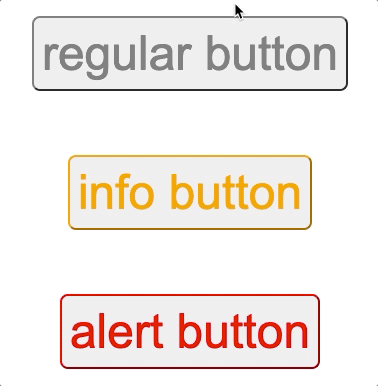

# Exercise: Button Colors



## 📝

1. Add the `transform` value to the `.btn` via the `$transition` variable
    - We already have a $transition variable defined with the correct transform value.
    - Add the declaration transition: $transition; to the .btn rule.
    <details>

    ```scss
    .btn {
    /* other declarations */
        
    transition: $transition;
    }
    ```

    </details>

2. Add `transform` to nested `hover` pseudo-class
    - Instead of creating a new declaration with the selector `.btn:hover`, use the nested selector `&:hover` under the `.btn selector`
    - Add `transform: scale(1.1);` as its declaration.
    <details>

    ```scss
    .btn {
    /* other declarations */
        
    &:hover {
        transform: scale(1.1);
    }
    }
    ```

    </details>

3. The buttons should now animate as shown in the gif. (no colors yet)
4. Define two more variables to hold the info and alert values. Name them as you like, but something like $info-color would be great!
5. Info should be orange, and Alert should be red.
    <details>

    ```scss
    $info-color: orange;
    $alert-color: red;
    ```

    </details>

6. Define two nested rules using the & syntax to refer to the parent selector. These rules should use the two variables defined in the last step in order to set the `color` and `border-color` properties.
    <details>

    ```scss
    &-info {
        color: $info-color;
        border-color: $info-color;
    }

    &-alert {
        color: $alert-color;
        border-color: $alert-color;
    }
    ```

    </details>
7. The info and alert buttons should now show with their respective colors.

## Knowledge Check ✅
1. Check this box when your animations and colors match the gif above
    - My animations and colors match the gif above