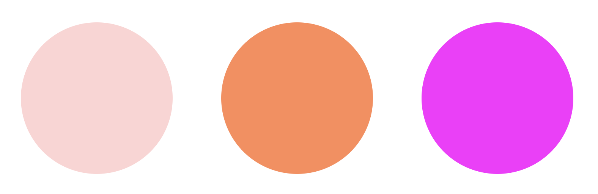

# Colorful Circles



## 📝

### 1a. Move the `width` and `height` to a mixin.

1. Move the `width` and `height` to a mixin called `circle`.
2. Add a `border-radius: 50%` to create circles rather than squares.

### 1b. Apply the mixin to the color classes.

3. Using the [`@include`](https://sass-lang.com/documentation/at-rules/mixin) keyword, apply the circle mixin to each of the three color classes.
4. **RESULT**: The `div`s should show as circles `200px` wide and high.

### 2a. Write a `colorize-red` function

**GOAL**: Add a bit of red to the circles with `@use 'sass:color';` and [`color.adjust`](https://sass-lang.com/documentation/modules/color) within the function.

1. Write a function, `colorize-red`. The function should accept
    - An `$original-color` (a string)
    - An `$amount` (a number between 0 and 255)

2. The function should return a color code as the original color, with the passed-in amount of red added in.
   - **NOTE**: `color.adjust` returns either a hex code or a color keyword, if it is one of the keyword.

> It is often helpful to use the @debug statement when writing SASS. It's similar to console.log in JavaScript.

### 2b. Invoke the `colorize-red` function

3. Each class has the `background` property, with its own color as the value. Replace the color code with an invocation of `colorize-red` and the color code passed in.
4. **RESULT**: The circles should now each be color shifted to be more red, as seen in the example above.

## Knowledge Check ✅

1. Check this box when your circles and colors match the gif above
    - My circles and colors match the image above

### Solutions

**`width` and `height` Mixin**

<details>

```scss
@mixin circle {
    width: 200px;
    height: 200px;
    border-radius: 50%;
}
```
And remember to remove `width` and `height` from the classes below!

</details>

**Include circle mixin**
<details>

```scss
.grey {
    @include circle;
    background: lightgray;
}
```

</details>

**`colorize-red`**
<details>

```scss
@function colorize-red($original-color, $amount: 255) {
    @return color.adjust($original-color, $red: $amount);
}
```

</details>

**Invoking `colorize-red`**
<details>

```scss
.grey {
    @include circle;
    background: colorize-red(lightgray, 255);
}
```

</details>