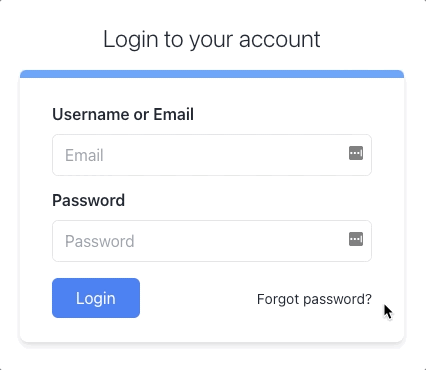

# Tailwind Login



## 📝

### 1. Load Tailwind onto the page
1. Add tailwind via a script before the closing </body> tag.
2. In the outermost `div`, center the login form via [mx-auto](https://tailwindcss.com/docs/container#using-the-container), and center the text within the form via [text-center](https://tailwindcss.com/docs/container#using-the-container).
3. Increase the size of the text in the `span` heading on top of the form, and lighten the weight at the same time. Add the `text-2xl font-light` classes.
4. By mixing the size, shadow, rounded corners and text align, create a card effect. Add the classes `mt-4 bg-white shadow-md rounded-lg text-left`.
5. Add padding to both the horizontal and vertical axes with `px-8 py-6`.
6. For BOTH inputs, add many classes to do the following:
    - `border` - Adds a border while the input is inactive
    - `w-full` - Tells the input to take up the [entire horizontal space](https://tailwindcss.com/docs/width#percentage-widths)
    - `h-5`  - Adds [height](https://tailwindcss.com/docs/height)
    - `px-3` - Adds [horizontal padding](https://tailwindcss.com/docs/padding#add-horizontal-padding)
    - `py-5` - Adds [vertical padding](https://tailwindcss.com/docs/padding#add-vertical-padding)
    - `mt-2` - Adds [margin to the top](https://tailwindcss.com/docs/padding#add-vertical-padding)
    - `rounded-md` - [Rounds the corners](https://tailwindcss.com/docs/padding#add-vertical-padding)
    - `focus:outline-none` - [Removes default outline](https://tailwindcss.com/docs/outline-style#removing-outlines) when focus is on input
    - `focus:ring-1` - Adds [custom outline](https://tailwindcss.com/docs/outline-style#removing-outlines) when focus is on input
7.  To add margin to the top of the password label, add `mt-3` and set it to display block.
8. The button and forgot password link are too close, so use `display: flex` and `justify-content: space-between` to push them apart.
9. The login button doesn't look like a button. Add the following to style it as a button.
    - `mt-4`
    - `bg-blue-500`
    - `text-white`
    - `py-2`
    - `px-6`
    - `rounded-md`
    - `hover:bg-blue-600`
10. For the anchor tag, add `underline on hover:`. Set the text size smaller with `text-sm`.
11. To tie it in, add a little blue ribbon at the top. To the empty div right inside the card div, add some height, a blue background, and round the top corners with h-2 bg-blue-400 rounded-t-md.

## Knowledge Check ✅

1. Check this box when your login form matches the gif above
    - My login form matches the gif above

### Solution

<details>

```html
<!DOCTYPE html>
<html>
    <head>
        <title>Tailwind Login</title>
    </head>
    
    <body class="min-h-screen flex flex-col justify-center bg-gray-100">
        <!-- 2. center login form and text within login form -->
        <div class="mx-auto text-center">
            <!-- 3. Size up text for heading -->
            <span class="text-2xl font-light">Login to your account</span>
            <!-- 4. Add floating card background with rounded corners -->
            <div class="mt-4 bg-white shadow-md rounded-lg text-left">
                <!-- 11. add blue accent line on top of card -->
                <div class="h-2 bg-blue-400 rounded-t-md"></div>
                <!-- 5. Add padding to the card background -->
                <div class="px-8 py-6">
                    <div>
                    <label> Username or Email </label>
                    <!-- 6. style the inputs -->
                    <input type="text" placeholder="Email"class="border w-full h-5 px-3 py-5 mt-2 rounded-md focus:outline-none focus:ring-1 ">
                    <!-- 7. give password label some space -->
                    <label class="block mt-3"> Password </label>
                    <!-- 6. style the inputs -->
                    <input type="password" placeholder="Password" class="border w-full h-5 px-3 py-5 mt-2 rounded-md focus:outline-none focus:ring-1 ">
                    <!-- 8. space out login button and forgot password link (baseline is so that the link doesn't align to the top in the next steps) -->
                    <div class="flex justify-between items-baseline">
                        <!-- 9. style login button -->
                        <button type="submit" class="mt-4 bg-blue-500 text-white py-2 px-6 rounded-md hover:bg-blue-600 ">Login</button>
                        <!-- 10. style forgot password link -->
                        <a href="#" class="text-sm hover:underline">Forgot password?</a>
                    </div>
                </div>
            </div>
        </div>
    </body>

    <!-- 1. load in tailwind -->
    <script src="https://cdn.tailwindcss.com"></script>
    
</html>
```

</details>