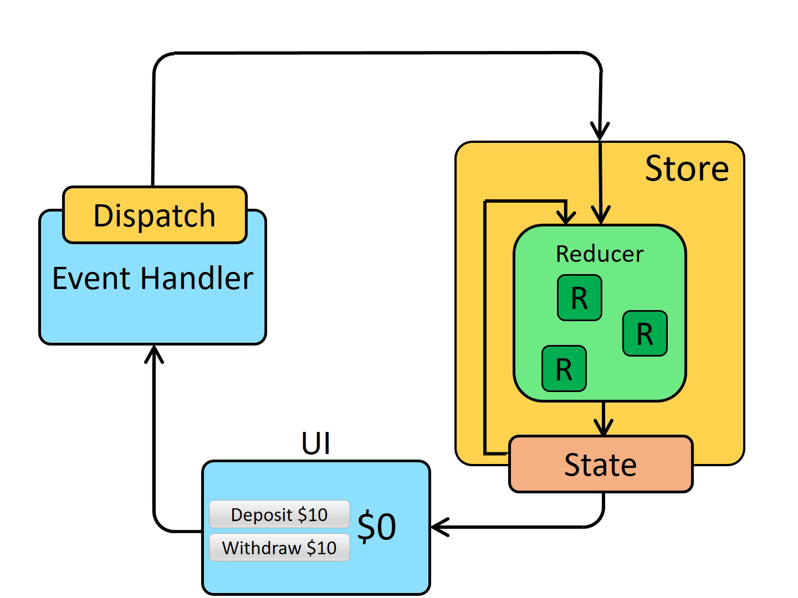

# Intro to Redux

As your applications grow in size, you'll reach a point where you could have hundreds or even thousands of components, and it will become virtually impossible to manage and share application state across that many component. While useState is great for keeping state in a single component or utilizing `useContext` to pass state around to a few components, these tools are difficult to use with large scale applications. 

⭐ <span style = "color: #21B581">**Redux is a pattern and library for managing and updating application state, using events called "actions".**</span>

### What We Will Learn
- Actions
- Reducers
- State
- The Store

>[Introduction to Redux Video](https://www.loom.com/share/62c76218adf54d90a4f70616ad9f3a53)

## Try It Out 💻

**TASK**: Increment and Decrement are already functioning, we're going to be implementing `incrementByAmount`! We'll be doing all of our work in `src/features/Counter.js`, but reference `counterSlice` if you need to see what actions are available to us.

1. Start by importing `incrementByAmount`.
    <details>

    ```jsx
    import { decrement, increment, incrementByAmount } from './counterSlice';
    ```

    </details>
2. Add an `onClick` on the "Increment by Amount" button to call `incrementByAmount` and pass the amount from local state
    - Since the entire application doesn't need to know what amount is currently entered into the input, we can still use `useState` to store that value **but**, once we want to increment the global state by an amount **redux needs to know that amount**.
    <details>

    ```jsx
    <button
    ...other stuff
    onClick={() => dispatch(incrementByAmount(amount))} /* ADD THIS LINE */
    >
    Increment by Amount
    </button>
    ```

    </details>

3. Now, clicking Increment by Amount should update the amount according to the value inside of the input

## Redux Data Flow



## #checkoutTheDocs 🔍
- **React Redux**: [Redux Overview and Concepts](https://redux.js.org/tutorials/essentials/part-1-overview-concepts)

## Knowledge Check ✅

1. Which of the following are benefits of using Redux to manage application state?
    - **Code organization**
    - **Ease of testing**
    - **Ensures predictable state updates**
    - **Centralized state across entire application**

2. Rearrange the following stages of Redux data flow in the correct order

```plaintext
User clicks a button
Event handler dispatches action
Store passes action and existing state to reducer
Reducer modifies and returns new state
Store returns new state to component
Component re-renders with new state
```