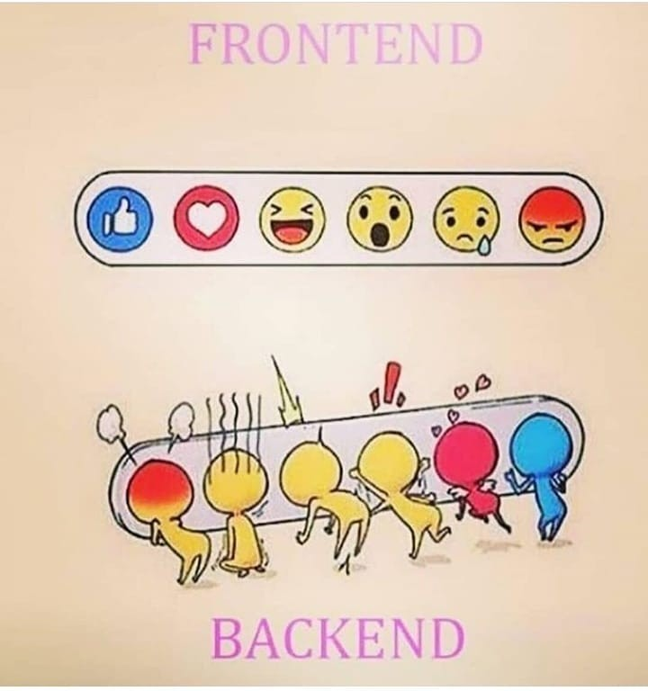

# Project Ideation

Considering that this is the Front End Elective, your project *should* primarily focus on the front end for this project. 

⭐️ **This project will not primarily focus on the Back End, but depending on the project topic you can:**
1. Use a free API from the **list below**
2. Create their own back end server
3. Use a cloud service back end like Google FireBase or MongoDB Atlas.

## Team Project Proposal
The premise of your app is entirely up to you and your team. Think through different ideas and come up with one. We’ve curated a collection of savory app ideas below. Use the list to get your creative juices going, but decide as a team and then submit a brief description below.

1. Briefly describe your app idea

## Suggestion: Use a Free/Public API
There are a ton of completely free-to-use JSON APIs available for you to consume. **Here is a GIANT list of Public APIs**:
- [Public APIs](https://github.com/public-apis)

Most of the APIs listed here contain documentation and sample data to get you up and running in no time at all. The APIs in this list are organized by category, so if you’re struggling for inspiration just browse the categories to see what’s available.

> We recommend using an API that has **No Auth** (the table in the linked repo has a column for **Auth**, just check for **“No”** in the column to make sure there’s no barrier for entry.)
> - If you are so inclined to use an API that requires authentication (i.e. it requires an `apiKey`) then follow the instructions in the API’s docs to find out how to procure a key. In most cases its as simple as creating an account with the API to get an automatically generated key, but sometimes it takes a manual response from a real human to supply the key and that could take days or weeks to acquire, and we don’t have the luxury of waiting right now.

## A Few Examples:

### Hacker News Client
Use the [Hacker News API](https://github.com/HackerNews/API) to create a news client
- List popular posts
- Show a post comments
- Show a user profile
- Search Hacker News

### Movie Reel
- Using the [(unofficial) IMDb API](https://github.com/SpEcHiDe/IMDbOT)
- List popular movies by rating
- Show a movie summary page
- Search movies by actor or genre

### Books Library
Use the [Open Library API](https://openlibrary.org/developers/api)
- List books by author
- Show suggested/related books
- Search books by name/author/genre

### GitHub Client - 🔒 requires authentication (but you already have access!)
Since you already have a GitHub account, you already have access to this one! Check out the [getting started guide here](https://docs.github.com/en/rest/guides/getting-started-with-the-rest-api).
- List the popular repositories form today / week / month
- List the latest commits in a repository
- Show a person’s or organization’s public repositories ranked by stars

### Other Free APIs

Here’s a dozen examples (literally less than 1% of APIs available in the above linked repo 🤯 )
- [The Dog API](https://dog.ceo/dog-api/) 🐕
- [Animal Crossing API](http://acnhapi.com/) 🐶
- [Quotes API](https://favqs.com/api/) 💭
- [Chess.com API](https://www.chess.com/news/view/published-data-api) ♟️
- [Deck of Cards](http://deckofcardsapi.com/) ♠️
- [Free-To-Play Games Database](https://www.freetogame.com/api-doc) 🎮
- [Wikipedia API](https://www.mediawiki.org/wiki/API:Main_page) 📖 - This is one of the more robust APIs, and can be a little intimidated to get started in, here is a great tutorial to get started with this one.
- [PokeAPI](https://pokeapi.co/) ⚡ - We already used this one, so familiarity may give you a leg-up! maybe you can build a better Pokeverse!
- [Exchange Rates](https://github.com/fawazahmed0/currency-api#readme) 💰
- [Whiskey Hunter API](https://whiskyhunter.net/api/) 🥃
- [SpaceX API](https://github.com/r-spacex/SpaceX-API) 🚀