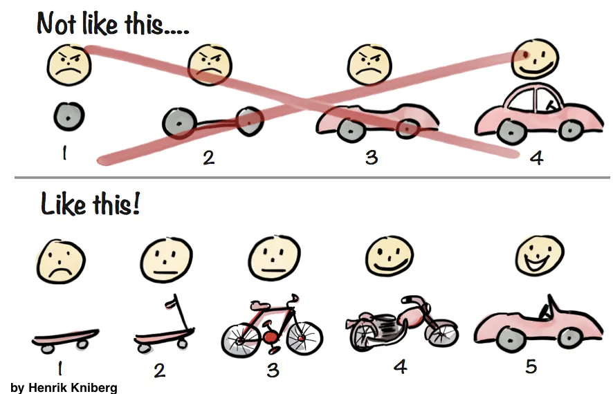

# MVP Definition

Recall that a **Minimum Viable Product (MVP)** is the simplest possible version of your application that has the components you require. ⭐️ **Instead of “we’re building a car” think “we’re building a thing that goes” Development is iterative!**

## Shoot for the Stars

Before we define our MVP, let's first shoot for the stars. Imagine you have unlimited time, money, and technical resources to build out your application. What would this application look like?

1. List all the amazing features you think your application could have and could ever hope to have!

## Define Your Beta (V2)

Now that we have a description of what the most amazing version of our application can look like, we need to scale it down since we only have 4 weeks to build it! List out ***as many*** features as you can think you can build given the 4 weeks you have to complete the application. Refer back to the features that you listed in the Shoot for the Stars portion above.

2. List out as many features as you can think of that would enhance the MVP application given the 4 weeks you have to complete the application.

## Define Your MVP
Before we can build our Beta (V2) version of our app, we need version 1! An MVP contains ONLY what is absolutely essential for your app to work. No “cool” features. Just the basics. Using everything that you defined in the last section, what are the essential components that your application MUST contain?

### An application idea with a possible MVP

- **IDEA**: Build an app that matches you to one of 50 different jobs based on a candidates personal interests 
- **MVP**: Make an app that lets you select a job from a list of three and then gives you information about the one you picked. 
- **Future Iteration Ideas**: Then we can expand the list to 5. Then we can add a matching matrix. Then we can expand to 10. The we can do multiple matches. Then we can expand to 20. Then to 50.

3. What is your Minimum Viable Product (bullet points work well!)