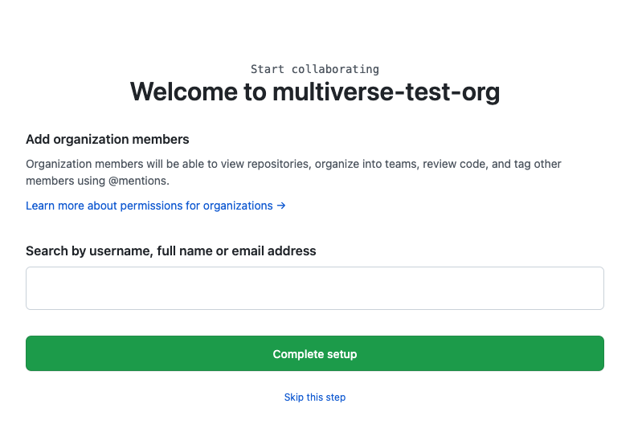
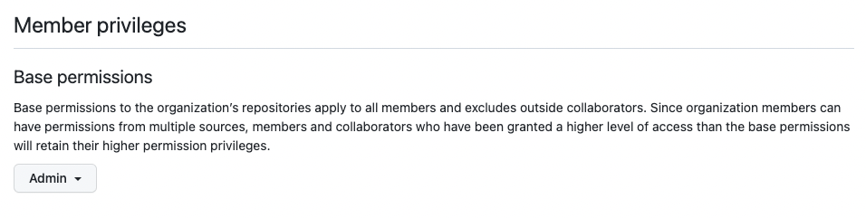

# Collaborating as a Team

In order to collaborate on a project like this in a bigger team, we need a way to share your work across multiple team members.  For this app, we’ll create a GitHub Organization and use GitHub Projects.

> These steps will be done by one person (ideally as a team, with one person screen-sharing)

## Create a GitHub Organization
In order to create a project with all the features we’ll need, you’ll create an organization.

1. Create a [GitHub Organization here](https://github.com/account/organizations/new?plan=team_free).
2. As part of the creation, add your team members **AND** your coach.

3. The next page has some optional questions. Feel free to skip over these.
4. If you skipped step 2 or forgot to add someone. Go to the “People” tab and invite each member of your team to the organization and **invite your coach**. This should be at a url like `https://github.com/orgs/<your-org-name>/people`.
5. Copy and paste the link to your GitHub Organization in the space below:

## Set Base Permissions to Admin

1. Under Settings → (under Access in the sidebar) → Member Privileges
2. In the “Base Role” box, click Manage.  This should be at a url like `https://github.com/organizations/<your-org-name>/settings/member_privileges`
3. Set the Base Permissions to Admin.

