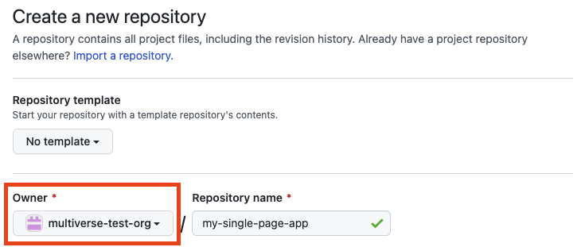
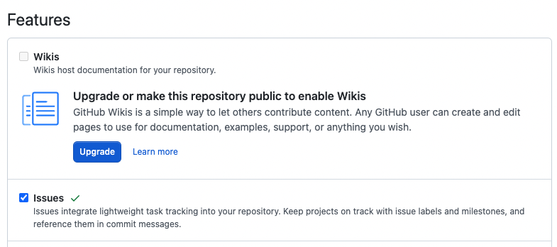

# Shared GitHub Repo

> Your repository should be “owned” by your organization (so all can access and push to the repo).

## Repository Setup

1. Go to https://github.com/new and choose a repo name (careful, this name will stick around for awhile!). Set your Organization as the “Owner” when making the repo. <span style = "color: #FE4646">**Create once for the organization, not per team member.**</span>



2. Copy and paste the link to your organizations forked repository in the space below.

3. Each team member should **clone your ORGANIZATION repo (the forked one)** to your machine locally.

```shell
git clone https://github.com/<your-gh-organization-name>/<your-app-name>

cd your-app-name
```

4. Initialize a package.json file. Run the following in your command 
```shell
npm init -y
```

5. We suggest using for our development environment and build. Run the following command in your root directory to install parcel:

```shell
npm install parcel
```

6. Add the following start and build command to your `package.json` scripts commands. **Remember the last item cannot not have a comma**.

```json
"start": "parcel index.html",
"build": "parcel build index.html"
```

7. Create a `_redirects` file and add the following:

```plaintex
/* /index.html 200
```
This will enable the server to send back the React app on any url request, yet still populate the correct URI for react router. This will only matter when we deploy our application.

8. Create a `.gitignore` file. This will ensure you don't commit things like your node_modules directory to GitHub. Inside the .gitignore file, paste in the following (this can vary from project to project, but this is a decent starting point for most projects):

```plaintext
https://help.github.com/articles/ignoring-files/ for more about ignoring files.

# dependencies
node_modules/
.pnp
.pnp.js

# testing
coverage/

# production
dist/
build/

# misc
.DS_Store
.parcel-cache
haters
.env
.vscode
.cache

# package managers
npm-debug.log*
yarn-debug.log*
yarn-error.log*
.npmrc

# sqlite
*.sqlite
```

## Enable Issues
1. Under your repo’s Settings → General navigate to the "Features" section on the page.
2. Check “Issues” checkbox. This enables you to write issues and assign them to each other when working with the projects.

