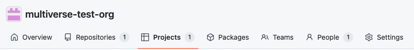
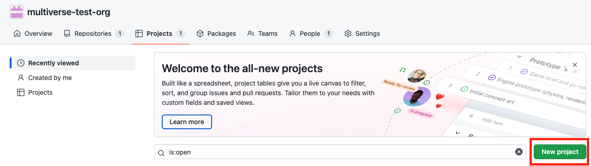
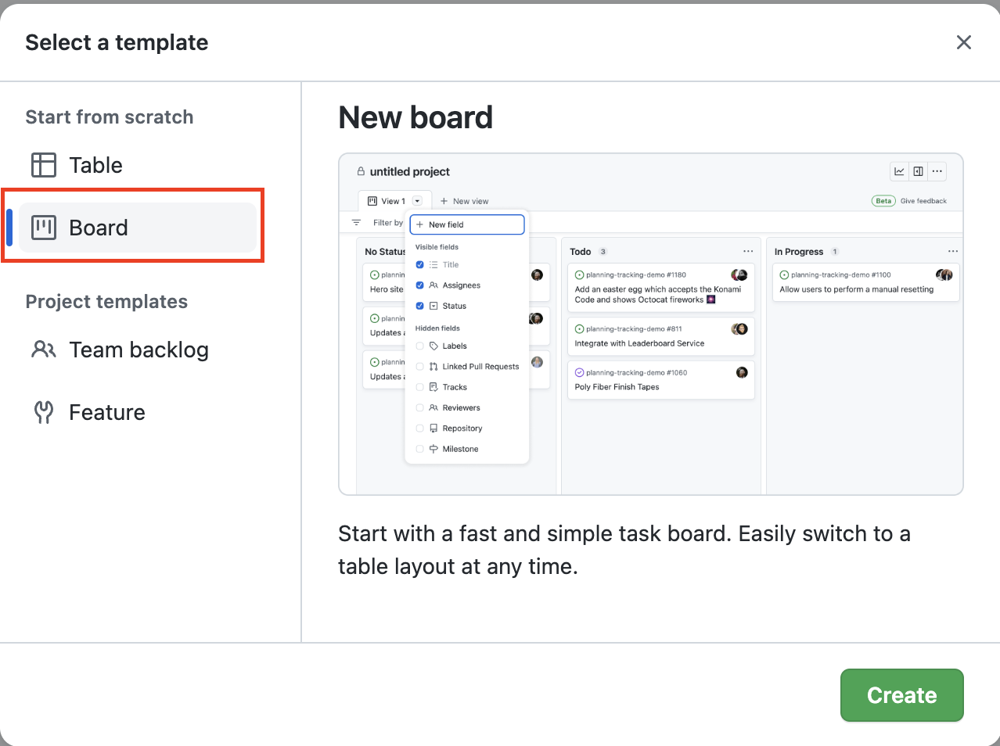
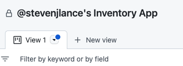
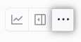
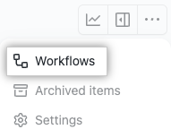
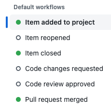
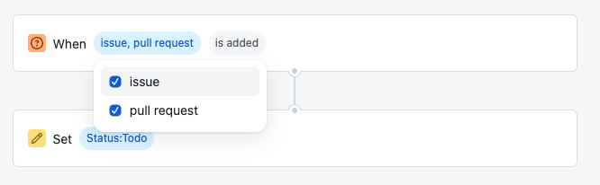
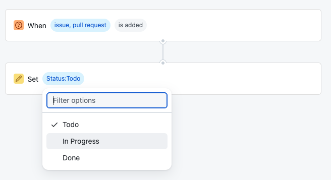
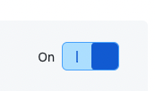

# GitHub Projects

## GitHub Project Board

A GitHub Project is an adaptable spreadsheet that integrates with your issues and pull requests on GitHub to help you plan and track your work effectively.

To setup your project board, complete the following steps to create the setup:
1. Under your organization name, click "Projects".

2. Click "New project".

3. When prompted to select a template, click Table or Board to start with an empty project. Then, click Create.

4. Give your project a name.

5. Share the link to your Project board below.

## Board Automations
Projects includes built-in workflows that you can use to update the Status of items based on certain events. For example, you can automatically set the status to Todo when an item is added to your project or set the status to Done when an issue is closed.

It’s up to the team if you want to use automations, but it can be very helpful. You can read more about [board automations here](https://docs.github.com/en/issues/planning-and-tracking-with-projects/automating-your-project/using-the-built-in-automations).

To setup an automated board, use the following steps:
1. In the top-right, click `. . .`  to open the menu.

2. In the menu, click **Workflows**.

3. Under Default workflows, click Item added to project.

4. Next to When, ensure that both issues and pull requests are selected.

5. Next to Set, select Status:Todo.

6. Finally, toggle the off button in the upper right corner to on.

Your board will now be updated automatically whenever there is an issue or a pull request!