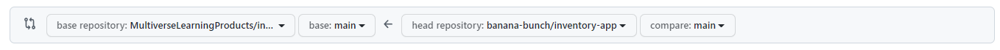
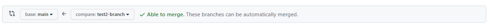

# Git Messages

If you take one message away from this section, it's that you should:

**NEVER commit directly to the main branch.**

## Commits and Pull Requests
It is expected that you will use syntactic names for feature branches and provide [descriptive semantic commit messages](https://www.conventionalcommits.org/en/v1.0.0/) (you can use [this reference for your semantic commit messages](https://gist.github.com/joshbuchea/6f47e86d2510bce28f8e7f42ae84c716)).

> When you begin to create a Pull Request. the base repository and head repository may be set to pull from the original Multiverse repo. You must set them to pull from the fork in your organization instead.  For example, change:
> 
> 
> 
> to
> 
> 

**IMPORTANT**: In order to maintain integrity of your application:
- **ONLY commit on your feature branch** (see below), and before opening a PR
- **ALL of your new code should be tested**, either with automated tests or manually (i.e. calling an API endpoint with Postman, viewing the application in the browser, running a seed script, etc).
- If one person introduces a bug without having tested it, all the other team members spend time debugging, and the lost time is multiplied across the team.

## Branching and PRs: When You Work On a Task 📝
For a given task with an existing GitHub team project, we recommend the following workflow:

1. **Anybody**: Make a GitHub issue for the task (including any relevant labels).
2. **Anybody**: Assign a pair (or yourself, or one person, **Coder**) to work on the task.
3. **Coder**: Move the card from "To do" to "In progress"
4. **Coder**: Branch off of main (use `git checkout -b branch-name-here` to create a new branch)
5. **Coder**: Continually edit and `git commit -m "message"` (over and over).
6. **Coder**: If any updates get made remotely to GitHub's dev branch, locally switch to `main`, `git pull`, switch back to your working branch, then `git merge main`. Fix conflicts.
7. **Coder**: Push the branch to origin whenever you want to: 
    - Make / update a pull request
    - Share the current code with others (e.g. when switching driver and navigator)
    - Save it more persistently (e.g. in case something goes wrong with your local storage).
8. **Coder**: When task is "complete", [create a pull request](https://docs.github.com/en/pull-requests/collaborating-with-pull-requests/proposing-changes-to-your-work-with-pull-requests/creating-a-pull-request) (and reference the issue/card) on GitHub.
9. **Anybody**: Assign a person (**Reviewer**) not in the pair to code review the pull request.
10. **Reviewer**: Review the code:
    - **Reviewer**: If you have no comments (really you have none?), go to #11. Otherwise...
    - **Reviewer**: Make round of comments.
    - **Coder**: Address round of comments, likely repeating steps #5-7. Pass back to **Reviewer** for #10.
11. **Reviewer**: Merge the PR. Never merge your own PR.
12. **Everybody**:
    - `git checkout main`
    - `git pull`

## Git Branching and PRs 🔍
- **Atlassian**: [Git Feature Branch Workflow](https://www.atlassian.com/git/tutorials/comparing-workflows/feature-branch-workflow)
- **GitHub**: [About Pull Request Reviews](https://help.github.com/articles/about-pull-request-reviews/)