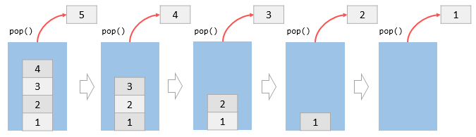

# Data Structures - Stacks
Hearing the term “data structures” usually brings forth some level of fear or confusion. They are often used  in Software Engineering technical interviews. They might seem archaic or even unnecessary for modern web development. Not only are ⭐️ <span style = "color: #21B581">**data structures common place in all forms of programming, but you are already using them everyday both on your computer and off!**</span>

A <span style = "color: #FE4646">**stack**</span> is a data structure that holds a list of elements. A stack works based on the LIFO principle (Last In, First out), meaning that the most recently added element is the first one to remove. 


### What We Will Learn:
- What’s a Stack?
- Interacting with a Stack
    - `push`
    - `pop`
    - `peek`
    - `size`/`isFull`
- Stacks in the real world

>[Stacks Video](https://www.loom.com/share/8b8c595262224251a372db64d5df84f7)

## Stacks and JavaScript

A stack has two main operations that occur only at the top of the stack: push and pop. The `push` operation places an element at the top of stack whereas the `pop` operation removes an element from the top of the stack.

JavaScript Array `type` provides the `push()` and `pop()` methods that allow you to use an array as a stack. Suppose we have the following code:

```javascript
let stack = [];
stack.push(1);
stack.push(2);
stack.push(3);
stack.push(4);
stack.push(5);
```

This code can be visualized using the following illustration:


By contrast, if we already have an array, then calling `.pop()` could look like:

```javascript
stack.pop();
stack.pop();
stack.pop();
stack.pop();
stack.pop();
```

This code can be visualized using the following illustration:



Since 5 was the last value into the stack, it is the first value to be removed when `.pop()` is called.

## Knowledge Check ✅

1. Which of the following methods are used to interact with a Stack?
    - **`push`**
    - **`pop`**
    - `map`
    - `slice`
    - `pull`

2. Which of the following accurately describes how elements are added and retrieved from a Stack?
    - FILO - First In, Last Out
    - **LIFO - Last In, First Out**
    - FIFO - First In, First Out
    - FICO - Frankly I Can’t think Of any other acronyms

3. What are examples of a Stack in every day life?
    - **A pile of books on a shelf**
    - **Plates in a cupboard**
    - **Web browser page history**
    - **Browser call stack**