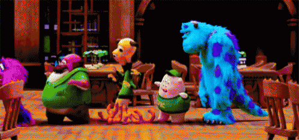

# Queues

When you get in line at the store, you are getting in a <span style = "color: #FE4646">**queue**</span>. We know from personal experience that the person at the front of the line gets served first since they were the first person in the queue. This is known as FIFO or First In First Out. 



In addition to being a very common structure we all have interacted with, a queue is a very common structure in programming. Just like a queue at a store, ⭐️ <span style = "color: #21B581">**a queue in programming keeps track of the order items were added by maintaining 2 pointers: a head and a tail (or a front and rear). Items are added into the back, and removed from the front.**</span>

### What We Will Learn:
- What is a Queue?
- Interacting with a Queue
    - enqueue (or `add`)
    - dequeue (or `remove`)
- Queues in the real world

>[Queues Video](https://www.loom.com/share/31365ce47ce741b7bf7cab8c2562f2b2)

## Queue Example

Suppose we have an empty queue. We can execute:

```javascript
queue.add(1);
queue.add(2);
```

This will add 1 from the rear and then add 2 from the rear (<span style = "color: #FE4646">**enqueue**</span>). 1 is the head of the queue and 2 is the tail.

When we want to remove a value, we can run:

```javascript
queue.remove();
```

Since 1 is at the head position, it is removed first since it is at the front of the queue (<span style = "color: #FE4646">**dequeue**</span>). We can represent this process using the following visual.


## Knowledge Check ✅

1. Which of the following are methods we would expend to find on a Queue?
    - **Enqueue**
    - **Dequeue**
    - Peek
    - Requeue
2. Which of the following accurately describes how elements are added and retrieved from a Stack?
    - **FIFO - First In First Out**
    - LIFO - Last In First Out
    - FILO - First In Last Out
    - LIPO - Last In Popped Off
3. Considering the following code, which of the following should be the correct order of console log outputs?
    ```javascript
    queue.add(7).add(42).add(52);
    console.log(queue.remove());
    console.log(queue.remove());
    queue.add(29);
    console.log(queue.remove());
    ```

****
```plaintext
1
2
3
52
42
29
```
****

```plaintext
1
2
3
42
7
29
```

```plaintext
1
2
3
29
52
42
```

```plaintext
1
2
3
7
42
29
```