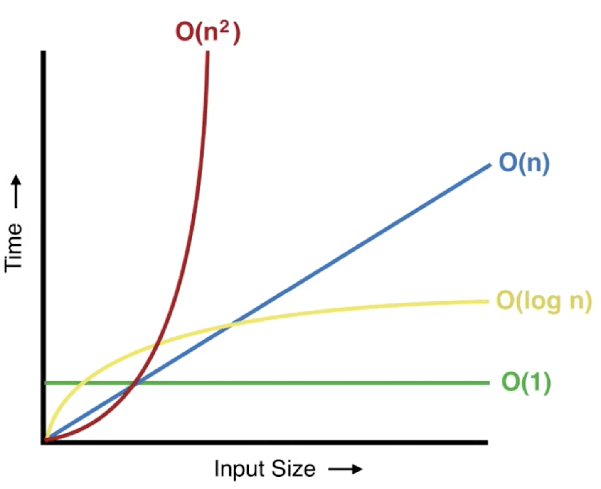

# Big O Notation

Have you ever considered what makes one particular algorithm *better* than another? If I gave you 2 different functions that both solved the same problem in different ways, could you explain why one might be preferable over the other? If not, today is your lucky day!

Believe it or not, not all programs are created equally.

Consider this prompt:
> *Write a function that takes an array as an argument and returns how many elements are in the array.*

**OPTION #1**: One way we could solve this is by iterating over the array, maintaining a `count` of how many elements we’ve encountered. 

```javascript
function count(arr) {
    let count = 0;
    for(let i = 0; i < arr.length; i++){
        count++;
    }
    return count;
}
```

This *would* work, and in most cases would probably be no problem. ⭐️ <span style = "color: #21B581">**But what if the array had 1 thousand elements in it, or 1 million. This would mean we mean our program would take 1 million operations to complete.**</span>

**OPTION #2**: Another way we could solve this would be utilizing the .`length` property that every `Array` already has. All we need to do is return array.length. 

```javascript
function findUsingLength(arr){
    return arr.length;
}
```

In 1 simple step we solve the same problem and return the same result, but no matter how big the array is this program will only take 1 step to execute! We potentially saved a LOT of time.

Both of the options above accomplished the stated task (find the size of the array), but one algorithm was much more efficient. ⭐️ <span style = "color: #21b581"><span style = "color: #FE4646">**Big O Notation</span> is a way to measure an algorithm's efficiency by measuring the time it takes to run your function as the input grows.**</span>

### What We Will Learn
- Define Big O Notation
- Common Big O Notations

>[Intro to Big O Video](https://www.loom.com/share/a0b7a5bfe0f848e290ce75a0eb261753)

## Big O Notation

Big O is typically written like this: **O(n)** or **O(1)** or **O(log n)** where everything inside the parenthesis is the calculated time complexity. Spoken out loud, they would read “Oh of n”, or “Oh of 1” or “Oh of Log n”.



When analyzing worst case scenarios with Big O, exponential and factorial algorithms typically become very ***inefficient*** when using a large number of inputs.

## Knowledge Check ✅

1. Complete the following sentence: Big O analyzes only the __________
    - **worst case scenario.**
    - best case scenario.
    - lowest order term

2. O(n) is a _________ time complexity
    - Logarithmic
    - Constant
    - **Linear**
    - Quadratic

3. O(1) is a _________ time complexity
    - Logarithmic
    - **Constant**
    - Linear
    - Quadratic