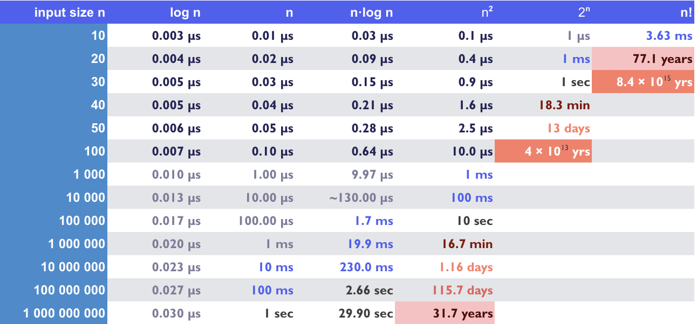

# Big O and Time Complexity

Ok...so what? We’ve learned about Big O, we understand that it might take one program a little bit longer to run than another, but why exactly does that matter? Suppose a computer can do one algorithm step ("operation") in one nanosecond (billionth of a second). If your algorithm f(n) has an input n of a given size, this chart shows how long it would take to perform that algorithm for common time complexities.

As you can see, ⭐️ **different algorithms can take vastly different amounts of time even if the amount of inputs is the same.**

### What We Will Learn
- Common Big O Notations
- Why Time Complexity Matters

>[Time Complexity Video](https://www.loom.com/share/0d308d9cd73e41489da5b4ec874521a7)

## Time vs. Space Complexity

While we’ve only learned about Time Complexity here, the same calculations exist for **Space Complexity**. In other words, as the size of the input grows, how does the size of the memory grow in relation? When our code runs, it’s storing real physical data in memory. Ideally it’s not using much memory, but depending on the type of operation it could be storing a lot of data, and eventually our computers could even run out of memory!

The calculations between Time and Space complexity are the same, and they can be explained in the exact same way with the same notations. The word “space” is virtually interchangeable with “time” throughout this entire lesson.

## #checkoutTheDocs 🔍
- [Big O Cheat Sheet](https://www.bigocheatsheet.com/)
- [Project Euler](https://projecteuler.net/)
- [Big O Deep Dive](https://www.freecodecamp.org/news/big-o-notation-why-it-matters-and-why-it-doesnt-1674cfa8a23c/)

## Knowledge Check ✅

1. About how long would it take a program with **O(n!)** time complexity to run given an input size of 30
    - A few seconds
    - A few microseconds
    - A few years
    - **Longer than the time earth has even existed**
2. Why is a Logarithmic Big O (or, O(log n)) such a fast and desirable time complexity?
    - It has an instant lookup time
    - **With each operation the input size is cut in half**
    - It’s incredibly fast for small input sizes, but for large input sizes it drastically slows down