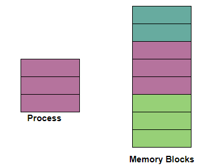
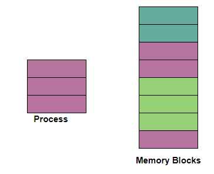

# Memory: Contiguous vs. Linked
In the last section, we learned and implemented a few basic data structures, we can now move into a more advanced topic and dig deeper into the building blocks of how data structures work. Today we’ll learn to understand and implement Linked Lists - but before we do that, let’s take a look at how the memory of our data structures is actually stored.

**Consider the following scenario:**

> *You’re building a product called BitStash to provide online Version Control for engineers, that they can use to add, commit, and push versions of their codebase. There could be any number of commits, and each commit could be any size (1 line change, or multiple files changed). Because of the variable number of individual commits, and the changing size of commit, we’ll want to store this dat across a variable amount of memory and even across multiple servers.*

There are two different types of memory to consider using: **contiguous memory** and **linked memory**.

### What We Will Learn
- 2 types of memory: Contiguous and Linked
- Downfalls of Contiguous Memory

>[Contiguous vs. Linked Memory Video](https://www.loom.com/share/44d460745e2a4714ae8a06a46de83e91)

## Contiguous vs. Linked Memory

In **contiguous memory allocation**, a single section of the contiguous memory is allocated to that process according to the requirements of the process. ⭐️ **All the available memory space remains together at one place and freely available memory partitions are not distributed here and there across the whole memory space.**

In **non-contiguous memory** allocation (or linked memory), a process is allowed to acquire several memory blocks at different locations and do not need to be stored together. ⭐️ **Memory space acquired by a process is not at one place but it is at different locations according to the requirements of the process.**

## Knowledge Check ✅

1. What are some benefits of Contiguous memory?
    - **No wasted space from storying memory addresses**
    - **Physical close location meaning faster operations**
    - Fixed size
    - Can quickly add any number of additional elements
2. What are some benefits of Linked (or non-contiguous) memory?
    - **Can quickly add any number of additional elements**
    - **Can be as large or as small as needed and can change size any time**
    - Fixed size
    - Compared to an Array, the same amount of items stores less overall memory