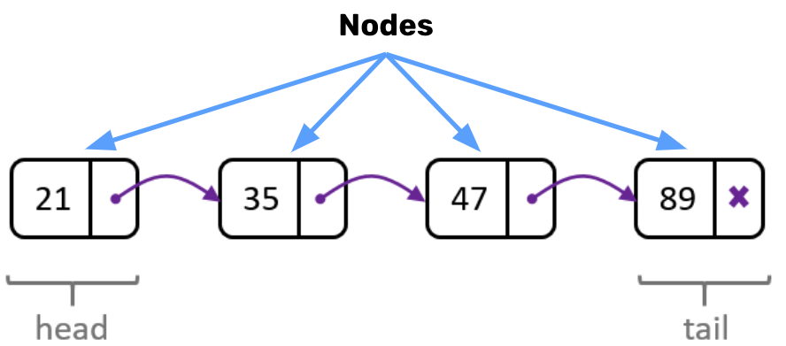

# Introduction to Linked Lists

Let’s get back to building BitStash! We already know that commits will be of different sizes, and some engineers may have a bunch of commits while others may only have a few. Because of this, it doesn’t make sense for us to store data in an Array (contiguous), so we’ll need to use something else: a <span style = "color: #FE4646">**linked list**</span>. ⭐️ <span style = "color: #21B581">**A linked-list is a dynamic data structure used in computer science. It consists of a collection of nodes where each node contains a piece of data (value) and a pointer (memory location) to the next node in the list.**</span>

### What We will Learn
- Structure of a Linked List:   
    - Head   
    - Tail   
    - Nodes
- Structure of a Singly Linked List Node

>[Linked Lists Intro Video](https://www.loom.com/share/5e373be43ced4ac994c2a0da25e5e536)

## Linked Lists

Linked lists are made up of nodes. Nodes contain:
1. A value
2. A "next" pointer that indicates the next value in the list.

The first node on the list is called the head and the last node on the list is called the tail.



## Knowledge Check ✅

1. Which 2 properties does every Singly Linked List’s Node contain?
    - **Value**
    - **Next**
    - Previous
    - Size

2. Given the following Singly Linked List, which node has a reference to “Jerry”?
    ```plaintext
    Frank ==> Michelle ==> Kimbo ==> Jerry ==> Mark ==> null
    ```
    - **Kimbo**
    - Mark
    - Frank
    - Michelle

3. Given the following Singly Linked List and the node we want to add, which node(s) need(s) to be modified to place the new node in the proper location?
    ```plaintext
    Frank ==> Michelle ==> Kimbo-->null
                    ^
                    Samantha
    ```
    - **Michelle and Samantha**
    - Michelle and Kimbo
    - Michelle
    - Frank