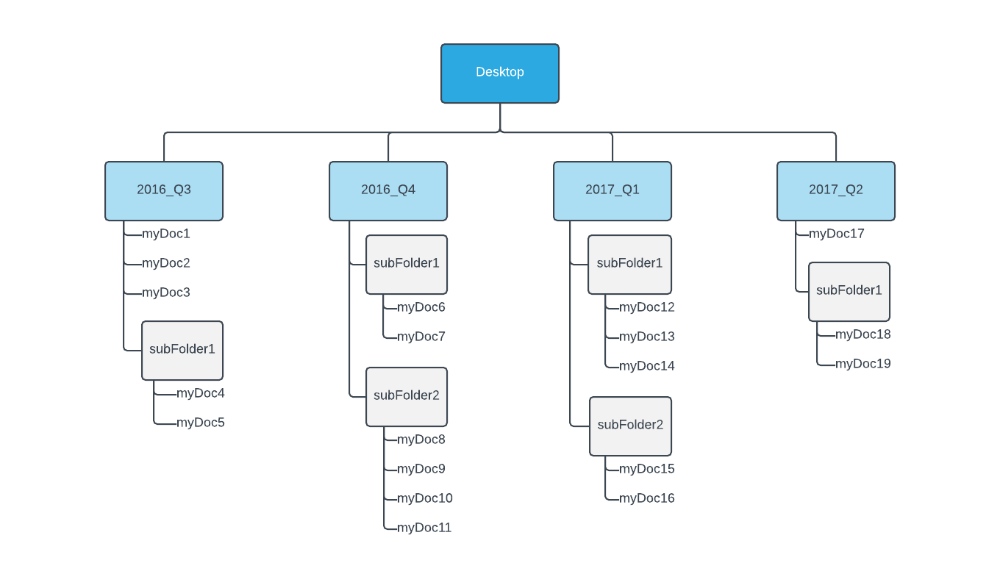
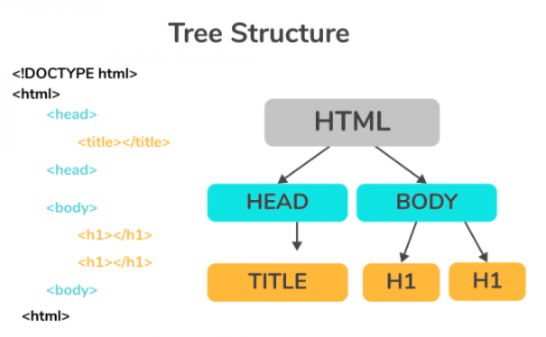
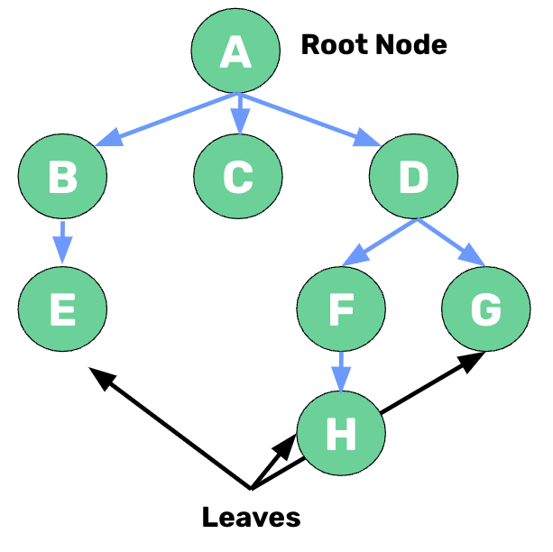
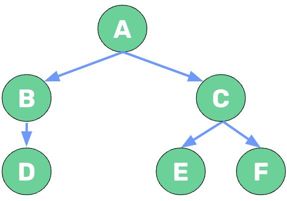

# Trees
Suppose you work for a popular photo-sharing platform: Facetagram. You have an array of all 8 billion user ids in order, starting from #1 all the way to #8,000,000. Unfortunately, only 7,999,999,999 ids are in the array! How can we find the missing ID *efficiently*. ⭐️ **The trees data structure allows us an efficient way to solve this problem.**

Trees can be found all over programming. Pretty much anywhere you find a hierarchy of information, it’s a tree! For example: the file structure on your computer is a tree - your desktop is a single folder with multiple folder inside of it, each of those folders have their own files and folders inside of them, and so on. 

One that you’ve already interacted with is the DOM! 

At the top of the DOM is the `<html>` tag, inside of that is a `<head>` and `<body>`. Inside of the body is all of the div, p and headings that make up a website.

### What We Will Learn
- What makes up a Tree in programming?
    - A node with a value
    - Children nodes are also the root node of their own trees
- Binary Tree
    - Each node has only 0, 1 or 2 children

>[Trees Video](https://www.loom.com/share/6a4caec90a944d8d920e3a3f6982b19e)

## Trees and Binary Trees

Trees are made up of nodes that contain value(s). Every tree has a primary "root' node with all children nodes being descendants of the root node. 

⭐️ **Binary trees are a specific type of tree where each node can have 0, 1, or 2 children nodes.** In the example below, A has 2 children nodes, B has 1 child node, and C has 2 child nodes.

## Knowledge Check ✅

1. What is the name of the initial node of a tree?
    - **Root**
    - Leaf
    - Head
    - Top

2. True or False: A tree with only 1 node and no children is a valid tree
    - **True**
    - False

3. What is the main characteristic of a binary tree?
    - **Each node has only up to 2 children**
    - Each node is connected twice
    - The values are only binary digits
    - Each node has only 2 parents