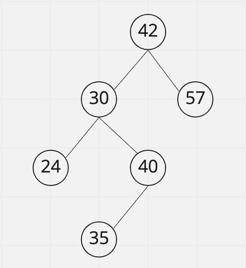

# Binary Search Trees
Trees allow for us to solve our problem of locating 1 specific ID out of a sorted array of 8,000,000,000. Without using a tree we could just start at the beginning of the array and search every single one until we find what we’re looking for. Worst case scenario we have to look at pretty much all 8 billion. 

We could try skipping every other ID, and that would help tremendously by removing 4 billion operations from our search, cutting the entire search time in HALF. That’s great, but there’s still 4 billion IDs to look at. What if I told you we could search through all 8 billion and find 1 specific ID in just 33 steps! 

⭐️ <span style = "color: #21B581">**A <span style = "color: #FE4646">binary search tree</span> is a node-based binary tree data structure which has the following properties**</span>:
- The left subtree of a node contains ***only nodes with keys*** lesser than the node’s key. 
- The right subtree of a node contains ***only nodes with keys*** greater than the node’s key. 
- The left and right subtree each must also be a binary search tree


⭐️ <span style = "color: #21B581">**Through sorting values into a binary tree, we can quickly search very large datasets in a minimal number of steps.**</span>

### What We Will Learn
- What makes a Binary Tree a Binary Search Tree?
- Root node satisfies ordering
    - Left < Root < Right
- Both children of a node are also Binary Search Trees

>[Binary Search Tree Video](https://www.loom.com/share/c604fb535e7644cb8063c5dd07f06b52)

## Binary Search Tree Example
Suppose we have the following array:

```javascript
let nums = [5, 11, 12, 14, 15, 18, 19, 21, 23, 25, 27, 28, 30, 32, 37];
```

We need to figure out if the array contains the number 27. While this is fairly simple for this small dataset, it would be very hard to just find a number of a very large dataset. Luckily, we can use a binary search tree to quickly find the value.

We can construct a binary search tree by taking the middle number of the array and placing all numbers larger than it to the right and all numbers smaller than it to the left. We can continue to apply this rule until the tree is constructed. To search for the number 27, we would see that the root node is 21, so we can then search only the values to the right since we know all numbers to the left are smaller than 21. We can repeat this process and find the number 27 in only 3 steps.


## Knowledge Check ✅

1. Which of the following statements are true of Binary Search Trees?
    - **The left subtree of a node contains only nodes with values less than the root node’s value**
    - **The right subtree of a node contains only nodes with values greater than the root node’s value**
    - **The left and right subtree each must also be binary search trees**
    - The root node value must be an even number

Use the following binary tree for questions 2 and 3



2. Considering the above Binary Search Tree, if we remove the root node, which node from the left subtree will be the new root?
    - **30**
    - 24
    - 40
    - 35

3. Considering the above Binary Search Tree, if we added a new node with the value of 37, that node would be places as the:
    - Right child of the node 35
    - Right child of the node 40
    - Left child of the node 40
    - Right child of the node 24